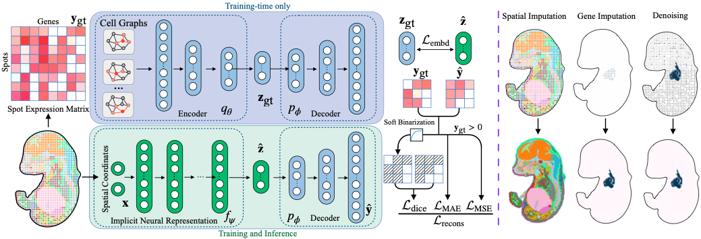

# SUICA

[**SUICA: Learning Super-high Dimensional Sparse Implicit Neural Representations for Spatial Transcriptomics**](https://arxiv.org/)<br />
[Qingtian Zhu](https://qtzhu.me)<sup>1*</sup>, [Yumin Zheng](https://scholar.google.com/citations?user=NQTC8NMAAAAJ&hl=en)<sup>2,3*</sup>, [Yuling Sang](https://scholar.google.com/citations?user=qfkckBkAAAAJ&hl=zh-CN)<sup>4</sup>, [Yifan Zhan](https://yifever20002.github.io)<sup>1</sup>, Ziyan Zhu<sup>5</sup>, [Jun Ding](https://meakinsmcgill.com/ding/)<sup>2,3,6</sup>, [Yinqiang Zheng](https://www.ai.u-tokyo.ac.jp/ja/members/yqzheng)<sup>1</sup><br />
<sup>1</sup>The University of Tokyo, <sup>2</sup>McGill University, <sup>3</sup>MUHC Research Institute, <sup>4</sup>Duke-NUS Medical School,<br /> 
<sup>5</sup>Carnegie Mellon University, <sup>6</sup>Mila-Quebec AI Institute<br />
**ICML 2025**
<p align="center">
    <br>SUICA pipeline
</p>

## Environment

The configuration of running environment involves CUDA compiling, so please make sure NVCC has been installed (``nvcc -V`` to check the version) and the installed PyTorch is compiled with the same CUDA version.

For example, if the system's CUDA is 11.8, run the following commands to configure the environment:

```shell
conda create -n SUICA python=3.9 -y && conda activate SUICA
pip install torch torchvision --index-url https://download.pytorch.org/whl/cu118
pip install -r requirements.txt
```
## To Run Your Data

The typical data structure is as follows:
```
|-- custom_root_path
    |-- configs #configuration file for GAE training and GAE-INR joint training
        |-- ST
            |--embedder_gae.yaml
            |--inr_embd.yaml
    |-- data 
        |--preprocessed_data
            |--your_data.h5ad
    |logs
    |--networks
    |--scripts
    |--systems
    |--datasets.py  
    |--train.py # The main file
    |--utils.py
```

## Training

**Train the Graph AutoEncoder (GAE)**
```
python train.py --mode --embedder --conf ./configs/ST/embedder_gae.yaml
```

**Train the GAE-INR**
```
python train.py --mode --inr --conf ./configs/ST/inr_embd.yaml
```

## Citation
```
@article{zhu2024suica,
  title={SUICA: Learning Super-high Dimensional Sparse Implicit Neural Representations for Spatial Transcriptomics},
  author={Zhu, Qingtian and Zheng, Yumin and Sang, Yuling and Zhan, Yifan and Zhu, Ziyan and Ding, Jun and Zheng, Yinqiang},
  journal={arXiv preprint arXiv:2412.01124},
  year={2024}
}
```